## 📝 Documentos generados con IA – Guía completa (actualizado 2025-07-08)

---

### 📄 1. Estructura de los modelos (`/api/document-models`)

Cada plantilla se guarda en **JSON** con **tres** claves:

```jsonc
{
  "title": "Recibo de pago",             // encabezado legal dentro del docx
  "content": "En la ciudad de Córdoba…", // cuerpo con placeholders [ ]
  "recommendation": "Proveer al menos…"  // placeholder en la UI
}
```

| Clave            | Uso en el front-end                                                         |
| ---------------- | --------------------------------------------------------------------------- |
| `title`          | Se muestra como **modelTitle** y se envía a Mongo (`modelTitle`).           |
| `content`        | Prompt base que se concatena con los datos del usuario y se pasa a GPT-4o.  |
| `recommendation` | Guía que aparece como *placeholder* para que el abogado sepa qué completar. |

> El **nombre de archivo** que el usuario decide (`title` en `postDocument`) puede ser distinto del `modelTitle`.

---

### 🛣️ 2. Flujo end-to-end

```mermaid
sequenceDiagram
  participant UI
  participant API
  participant OpenAI
  participant Mongo

  UI->>API: POST /api/documents {title, modelTitle, model, info}
  API->>OpenAI: prompt = model + info
  OpenAI-->>API: {content, usage.tokens}
  API->>Mongo: guarda doc (+ descuenta ThemiCoins)
  API-->>UI: doc completo (content, coinsCost…)
  UI->>UI: muestra popup (copiar, descargar .docx)
```



---

### 🔑 3. Esquema `GeneratedDocument`

```ts
{
  title:       String,   // nombre visible en la lista del usuario
  modelTitle:  String,   // encabezado legal
  userUid:     String,
  model:       String,   // plantilla base
  info:        String,   // datos personalizados
  content:     String,   // texto final generado
  tokens:      Number,   // solo completion
  totalTokens: Number,   // prompt + completion
  coinsCost:   Number,
  createdAt:   Date,
  updatedAt:   Date
}
```

---

### 💸 4. Cálculo de coste

```
coinsCost = Math.ceil(totalTokens * COINS_PER_TOKEN)
```

Ejemplo → `totalTokens = 72`, `COINS_PER_TOKEN = 0.04`  ⇒  `coinsCost = 3`.

---

### 🧩 5. Archivos clave

| Ruta                                             | Rol principal                                              |
| ------------------------------------------------ | ---------------------------------------------------------- |
| `src/app/api/documents/route.ts`                 | POST / GET de documentos                                   |
| `src/app/api/documents/[id]/route.ts`            | GET / DELETE de documento                                  |
| `src/lib/models/Document.ts`                     | Esquema Mongoose                                           |
| `src/lib/generateDocument.ts`                    | Llama a GPT-4o y calcula `coinsCost`                       |
| `src/components/DocxDownloadButton.tsx`          | Descarga del `.docx` (botón)                               |
| `src/utils/generateDoc.ts`                       | Inyecta datos en `template.docx` usando Docxtemplater      |
| `src/app/menu/documents-generator/page.tsx`      | UI principal (crear, lista, popup, **copiar / descargar**) |
| `src/app/menu/documents-generator/[id]/page.tsx` | Vista detallada individual (copiar / eliminar)             |

---

### 📥 6. Generación y descarga de `.docx`

#### 6.1 Componente **DocxDownloadButton**

```tsx
interface DownloadButtonProps {
  documentTitle: string; // irá a <<title>> dentro del doc
  body: string;          // irá a <<body>>
  fileName?: string;     // nombre del archivo (sin .docx)
}
```

```tsx
<DocxDownloadButton
  documentTitle={doc.modelTitle}
  body={doc.content}
  fileName={doc.title}
/>
```

#### 6.2 Flujo interno

1. **`DocxDownloadButton`** llama a

   ```ts
   generateDocFromJSON({ documentTitle, body })
   ```
2. **`generateDocFromJSON`**

   ```ts
   doc.setData({ title: documentTitle, body });
   ```

   > ⚠️ La plantilla `template.docx` debe tener `<<title>>` y `<<body>>`.
3. Se genera un **Blob** y se descarga con **file-saver**:

   ```ts
   saveAs(blob, `${fileName ?? documentTitle}.docx`);
   ```

---

### 🖇️ 7. Hooks / helpers front-end

```ts
// crear documento
await postDocument({ title, modelTitle, model, info });

// obtener lista
const docs = await getDocuments(); // {title, modelTitle, coinsCost…}

// detalle individual
const doc = await getDocument(id);
/*  muestra:
    - modelTitle (encabezado legal)
    - content    (cuerpo generado)
    - botones    (Copiar, Descargar .docx, Eliminar)
*/
```

---

### ✅ 8. Checklist de integración

* [x] Placeholder en el template: `<<title>>`, `<<body>>`.
* [x] `DocxDownloadButton` usa `documentTitle`, `body`, `fileName`.
* [x] `generateDocFromJSON` inyecta `{ title: documentTitle, body }`.
* [x] Prop `coinsCost` calculado antes de guardar.
* [x] UI muestra saldo y bloquea generación si `coinsBalance <= 0`.
